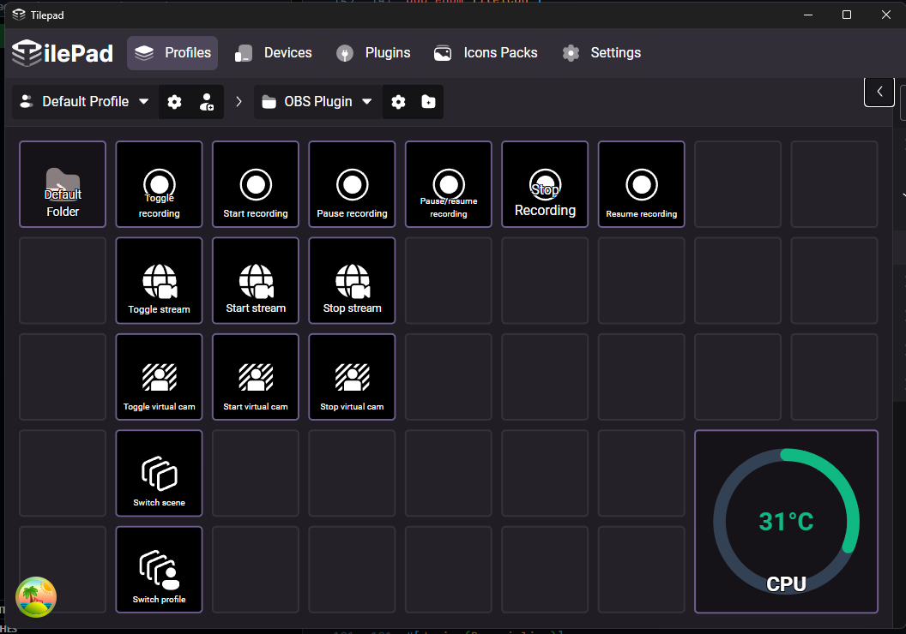

<table>
<tr>
<td>

(Official Tilepad Plugin)
</td>
</tr>
</table>

# Tilepad Plugin System Indicators

> This is currently still a prototype

Plugin which allows you to create indicators for various system components like CPU and GPU temperatures

You must install the background service in order to obtain temperatures [LHM Service](https://github.com/jacobtread/lhm-service/releases/latest) 

